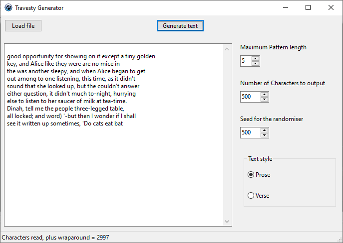
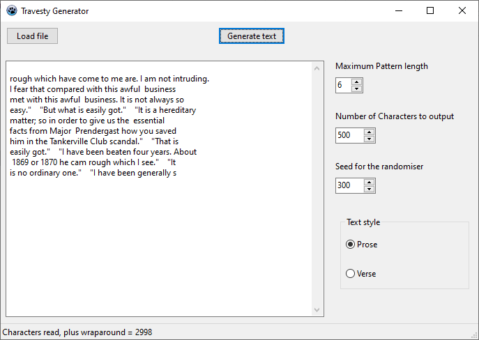

# Travesty
## A parody text generator

This is taken from the article published in [BYTE Magazine in 1984](https://archive.org/details/byte-magazine-1984-11/page/n129/mode/2up)

Literary critic Hugh Kenner and computer scientist Joseph O'Rourke introduced their text scrambler "Travesty" in an issue of BYTE magazine 1984.
See the [Wikipedia page](https://en.wikipedia.org/wiki/Parody_generator) for more information.

The code has been mostly preserved, I've just added a GUI to make it easier to play around with the options and included a copy of Alice in Wonderland.
A Windows binary is available on the [Releases page](https://github.com/cyberfilth/travesty/releases/tag/2).
